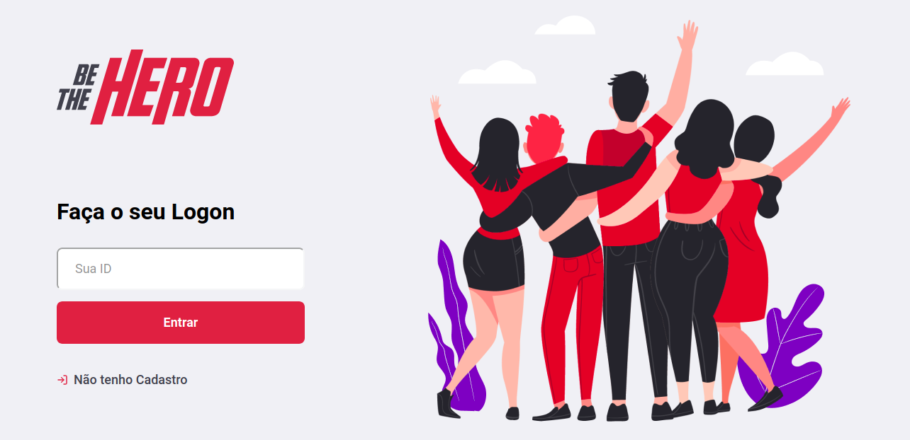
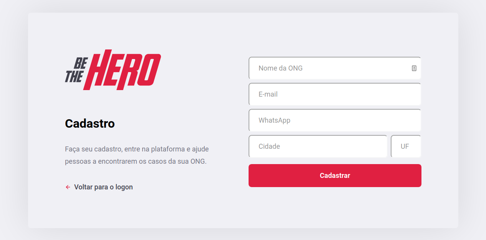
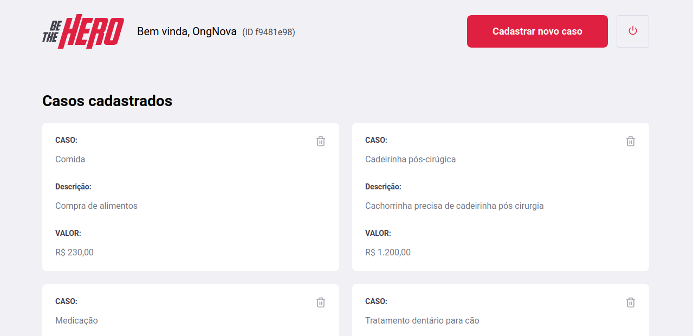
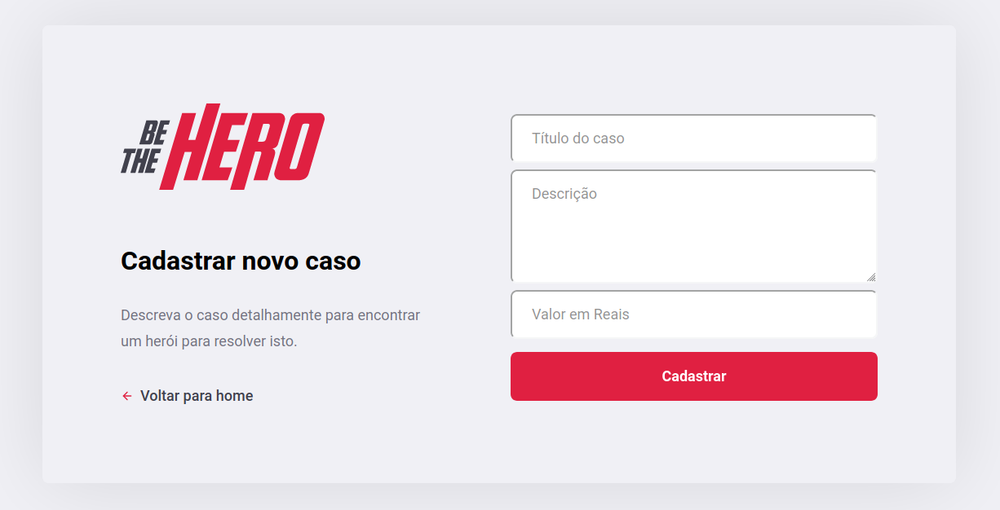
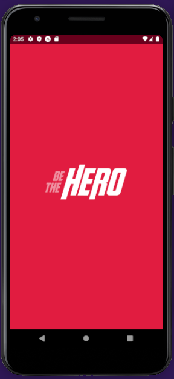
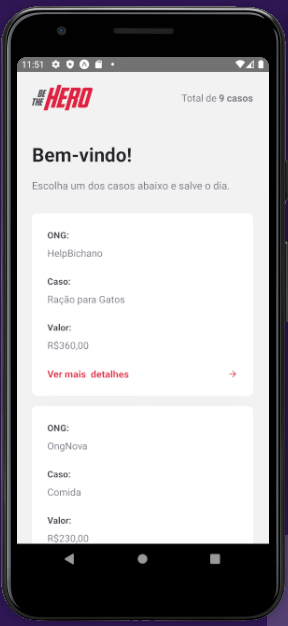
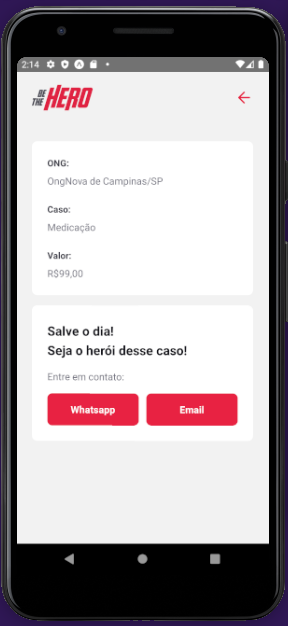

# Be The Hero

:rocket: App **Be The Hero** desenvolvido durante a 11ª Semana Omnistack da [Rocketseat](https://rocketseat.com.br/) realizada entre os dias 23/03 e 29/03/20


### A proposta:
- Ongs cadastram *Casos* (pedidos de ajuda) via aplicação frontend
- Usuários via app (aplicação mobile) visualizam os *Casos* das Ongs com opções de entrar em contato via Whatsapp ou Email

<br />

# Tecnologias e ferramentas em destaque utilizadas nesse projeto

### Backend

- [Node.js](https://nodejs.org/en/)
- [Express](https://expressjs.com/)   
- Nodemon
- SQLite3 Database
- [Knex - SQL Query Builder](https://knexjs.org/)   
- [Celebrate](https://github.com/arb/celebrate)
- CORS - define origens dos requets ao backend
- [jest](https://jestjs.io/) - framework para testes
- [cross-env](https://www.npmjs.com/package/cross-env) - definição e uso de variáveis ambientes
- [supertest](https://github.com/visionmedia/supertest) - chamadas a api usadas para teste de integração
- Insomnia para teste das rotas


### Frontend

- [React](https://reactjs.org/)   
- [Axios](https://github.com/axios/axios)


### Mobile

- [React Native](https://reactnative.dev/)
- [React Navigation](https://reactnavigation.org/)
- [Expo](https://expo.io/)
- [Expo MailComposer](https://docs.expo.io/versions/latest/sdk/mail-composer/)
- [Expo Constants](https://docs.expo.io/versions/latest/sdk/constants/)
- [Expo Vector Icons](https://github.com/expo/vector-icons)
- [Axios](https://github.com/axios/axios)

<br />

# Rodando as aplicações

Acesse as pasta backend, frontend, mobile e execute o comando:

```sh
$ yarn start
```

<br>

# Telas da aplicação Frontend para a Ong

### Logon


### Cadastro


### Visualização dos Casos (Pedidos de Ajuda) + Opção Deletar


### Cadastro de Novo Caso


<br><br>

# Telas da aplicação Mobile para Usuário

### Splash


### Visualização dos Casos


### Visualização de Detalhes de um Caso


---

Feito com ♥ by Tiago Dias Batista :rocket:
